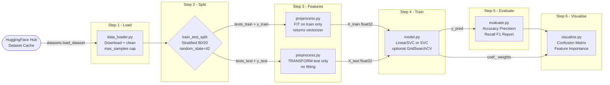
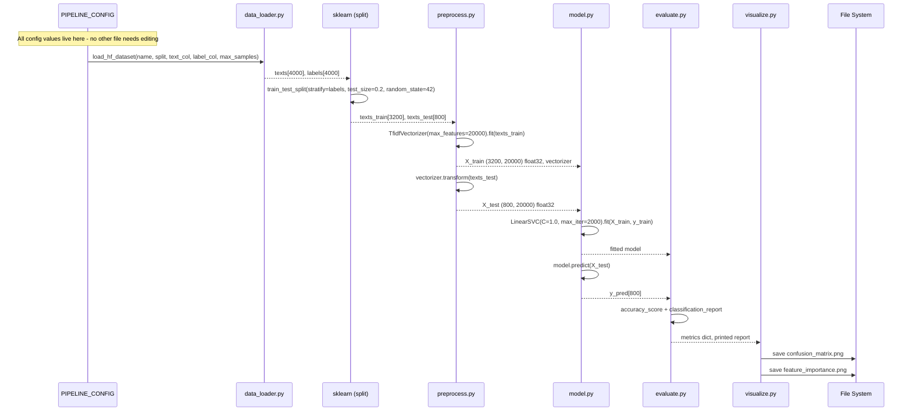
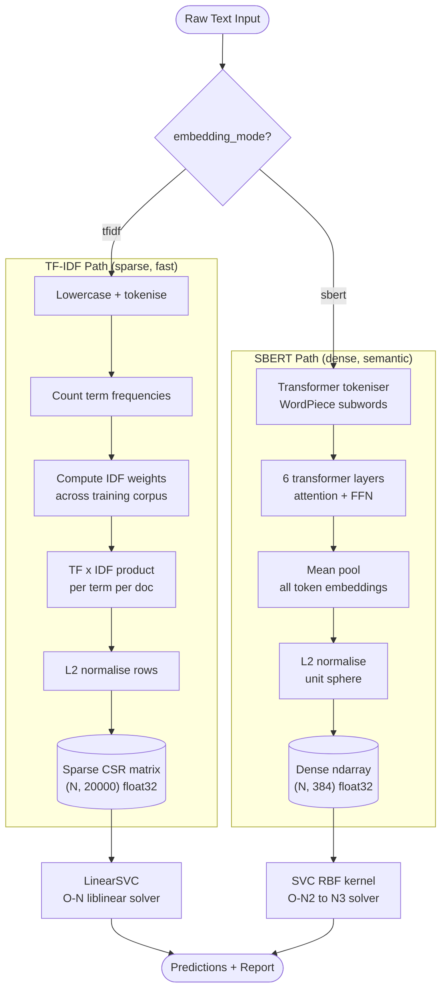
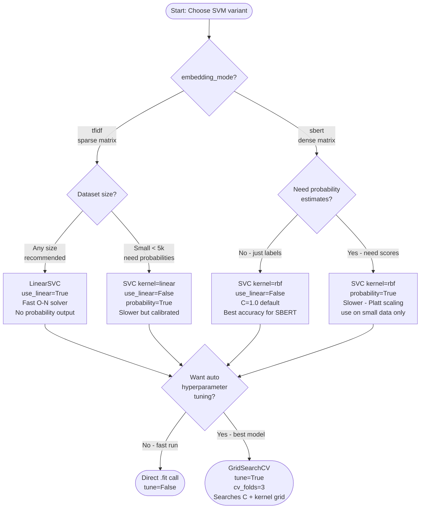
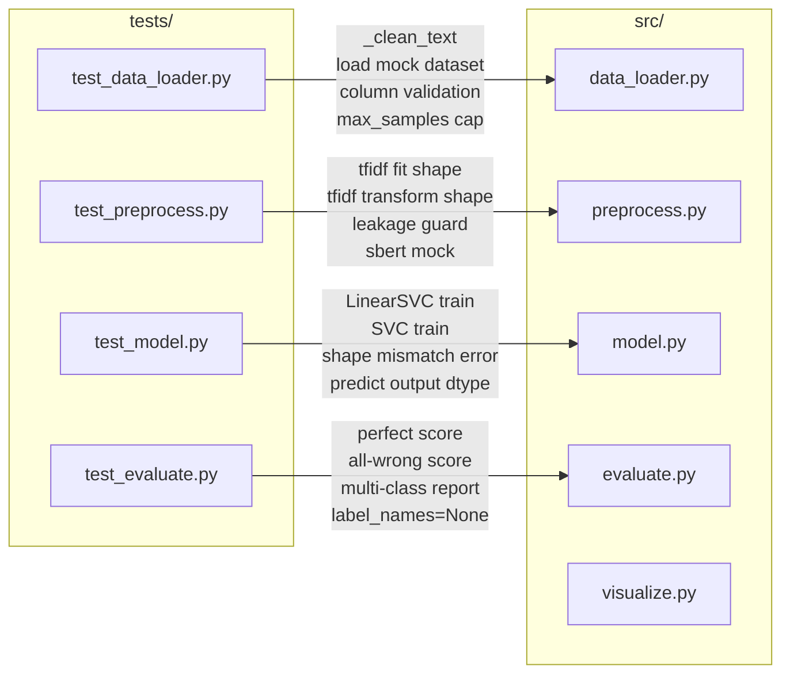

<div align="center">

# SVM Hugging Face Text Classifier

### A production-ready, fully modular NLP pipeline that trains Support Vector Machines on any Hugging Face dataset - no GPU required.

[](https://www.python.org/)
[](https://scikit-learn.org/)
[](https://huggingface.co/datasets)
[](LICENSE)

[](https://docs.pytest.org/)
[](https://peps.python.org/pep-0008/)
[](https://github.com/hkevin01/svm-hf-classifier)
[](https://github.com/hkevin01/svm-hf-classifier)
[](https://github.com/hkevin01/svm-hf-classifier/pulls)
[](https://github.com/hkevin01/svm-hf-classifier)
[](https://github.com/hkevin01/svm-hf-classifier)

</div>

---

## What This Project Is

This repository is a **complete, end-to-end text classification pipeline** built around Support Vector Machines. It is not a toy snippet or a Jupyter notebook demo - it is a structured Python project with isolated modules, a full unit test suite, visualisation outputs, and a single configuration dictionary that controls every aspect of the pipeline without requiring any source edits. You point it at any text dataset on the Hugging Face Hub, choose your feature extraction strategy and SVM variant, and run one command. The pipeline handles everything else: downloading and caching the dataset, splitting it without leakage, building features, training the model, printing a full classification report, and saving visualisation plots to disk.

The project exists because the gap between toy tutorials and production transformer fine-tuning is enormous. A well-tuned SVM with TF-IDF features achieves 90-94% accuracy on standard news classification benchmarks in under 30 seconds on a laptop CPU. That is often good enough, and it runs anywhere without a GPU, CUDA drivers, or cloud credits. This pipeline gives you that strong baseline with no shortcuts removed.

---

## Table of Contents

- [Why SVMs Still Matter](#why-svms-still-matter)
- [Tech Stack and Architecture](#tech-stack-and-architecture)
- [Project Structure](#project-structure)
- [Pipeline Overview](#pipeline-overview)
- [Data Flow and Module Interactions](#data-flow-and-module-interactions)
- [Quick Start](#quick-start)
- [Configuration Reference](#configuration-reference)
- [Feature Engineering Modes](#feature-engineering-modes)
- [Supported Datasets](#supported-datasets)
- [Model Selection Guide](#model-selection-guide)
- [Hyperparameter Tuning](#hyperparameter-tuning)
- [Performance Benchmarks](#performance-benchmarks)
- [API Reference](#api-reference)
- [Testing](#testing)
- [Outputs and Visualisations](#outputs-and-visualisations)
- [Advanced Usage](#advanced-usage)
- [Troubleshooting](#troubleshooting)
- [Roadmap](#roadmap)
- [Contributing](#contributing)
- [License](#license)

---

## Why SVMs Still Matter

Support Vector Machines were the dominant text classification algorithm before deep learning took over. They work by finding the maximum-margin hyperplane that separates classes in a high-dimensional feature space. The key insight is that in high-dimensional spaces (like a 20 000-term TF-IDF vocabulary), data is more likely to be linearly separable, which means a linear SVM can achieve near-optimal accuracy without needing a non-linear kernel. This is why `LinearSVC` on TF-IDF features is still a tough baseline to beat on topic classification tasks.

In 2024-2026, SVMs remain the right tool in several real-world situations. They train in seconds rather than hours, they require no GPU, they are fully interpretable through their coefficient weights, they generalise well on small and medium datasets, and they are trivial to deploy as a pickled sklearn object. When you are building a proof-of-concept, operating under compute constraints, need an explainable model for a regulated domain, or simply want to know whether a problem is hard before investing in a transformer, an SVM baseline is the right first step.

> [!NOTE]
> SVMs with TF-IDF features are particularly strong on **topic classification** and **sentiment analysis** tasks. For tasks requiring deep semantic understanding, paraphrase detection, or very short text, SBERT embeddings paired with an RBF-kernel SVM typically perform better.

---

## Tech Stack and Architecture

The project is built on seven carefully chosen libraries, each responsible for exactly one layer of the system. The architecture follows the Unix philosophy: each module does one thing well, and modules are composed together by `main.py`. There are no circular imports, no global state, and no hidden coupling between layers. This makes every module independently testable and swappable.

### Core Dependencies

| # | Library | Version | Layer | Role in Pipeline |
|---|---------|---------|-------|-----------------|
| <sub>1</sub> | <sub>`datasets` (HuggingFace)</sub> | <sub>>=2.19</sub> | <sub>I/O</sub> | <sub>Downloads, caches, and streams any of 50 000+ HF datasets with a single API call. Handles arrow-format caching so the network is only hit once per dataset.</sub> |
| <sub>2</sub> | <sub>`scikit-learn`</sub> | <sub>>=1.4</sub> | <sub>Features + Model + Eval</sub> | <sub>Provides `TfidfVectorizer`, `LinearSVC`, `SVC`, `GridSearchCV`, `train_test_split`, and all metric functions. The backbone of the entire ML pipeline.</sub> |
| <sub>3</sub> | <sub>`sentence-transformers`</sub> | <sub>>=3.0</sub> | <sub>Features (SBERT)</sub> | <sub>Wraps pre-trained transformer models to produce fixed-size semantic embeddings. Only loaded when `embedding_mode="sbert"` so it does not slow down TF-IDF runs.</sub> |
| <sub>4</sub> | <sub>`numpy`</sub> | <sub>>=1.26</sub> | <sub>Numeric core</sub> | <sub>All feature matrices are stored as float32 numpy arrays. The float32 dtype halves memory usage compared to float64 with no meaningful precision loss for SVM training.</sub> |
| <sub>5</sub> | <sub>`matplotlib`</sub> | <sub>>=3.8</sub> | <sub>Visualisation</sub> | <sub>Renders the confusion matrix heatmap and feature importance bar chart, then saves them as PNG files. Used through a non-interactive Agg backend so it runs in headless environments.</sub> |
| <sub>6</sub> | <sub>`seaborn`</sub> | <sub>>=0.13</sub> | <sub>Visualisation styling</sub> | <sub>Applies publication-quality colour maps and annotation styles to the confusion matrix heatmap via the `heatmap()` function built on top of matplotlib.</sub> |
| <sub>7</sub> | <sub>`tqdm`</sub> | <sub>>=4.66</sub> | <sub>UX</sub> | <sub>Wraps the SBERT encoding loop with a progress bar so you can see encoding progress on large corpora. Silent in non-TTY environments (CI/CD pipes).</sub> |
| <sub>8</sub> | <sub>`pandas`</sub> | <sub>>=2.2</sub> | <sub>Utilities</sub> | <sub>Used for lightweight data inspection and wrangling during dataset loading. Not in the hot path - purely a convenience layer for data exploration.</sub> |

### Architectural Layers Explained

The system is divided into four strict layers that form a one-way dependency chain. Code in a higher layer may call code in a lower layer, but never the reverse. This is enforced by the module structure and is the key reason the codebase is easy to test and extend.

**Layer 1 - I/O (`data_loader.py`):** All network communication and disk I/O is confined here. This module downloads datasets from the HuggingFace Hub, applies basic text normalisation (collapsing whitespace), and returns clean Python lists. Nothing else in the codebase touches the network or the HF cache. This isolation means you can write unit tests for every other module using synthetic data with no network dependency.

**Layer 2 - Features (`preprocess.py`):** Takes the raw text lists from Layer 1 and converts them into numeric matrices. The module supports two strategies - sparse TF-IDF and dense SBERT - and handles the fit/transform separation that prevents leakage. The vectoriser object is returned alongside the matrix so that `main.py` can pass the same fitted vectoriser to the test-set transform call.

**Layer 3 - Model (`model.py`):** Receives the feature matrices from Layer 2 and trains an SVM. The module abstracts the choice between `LinearSVC` and `SVC`, and optionally runs `GridSearchCV` to find optimal hyperparameters. It exposes a `predict()` function that wraps the sklearn `.predict()` method, making it easy to swap in a different classifier without changing `main.py`.

**Layer 4 - Evaluation and Output (`evaluate.py`, `visualize.py`):** Receives predictions from Layer 3 and computes metrics or saves plots. These modules are pure consumers - they take data in and produce output, but never feed back into training. The separation means you can reuse the evaluation module for any classifier, not just SVMs.

---

## Project Structure

```
svm-hf-classifier/
│
├── main.py                   # Entry-point + PIPELINE_CONFIG dict
├── requirements.txt          # Version-pinned dependencies
│
├── src/                      # All source modules - no scripts here
│   ├── __init__.py
│   ├── data_loader.py        # Layer 1: HF dataset download + clean
│   ├── preprocess.py         # Layer 2: TF-IDF or SBERT features
│   ├── model.py              # Layer 3: SVM train + GridSearchCV
│   ├── evaluate.py           # Layer 4: Accuracy, F1, report
│   └── visualize.py          # Layer 4: Confusion matrix + feature plot
│
├── tests/                    # Unit tests - one file per src module
│   ├── __init__.py
│   ├── test_data_loader.py
│   ├── test_evaluate.py
│   ├── test_model.py
│   └── test_preprocess.py
│
└── outputs/                  # Auto-created on first run
    ├── confusion_matrix.png  # Normalised heatmap
    └── feature_importance.png  # Top-20 TF-IDF coefficients (TF-IDF mode)
```

> [!TIP]
> The `src/` directory is a proper Python package (it has `__init__.py`). This means you can import any module from it in notebooks or scripts using `from src.model import train_svm` without modifying `sys.path`, provided you run from the project root.

---

## Pipeline Overview

The pipeline is a strict linear sequence of six steps. The order matters because step 3 (fitting the feature vectoriser) must happen before step 4 (transforming the test set), and both must happen after step 2 (splitting the data). Running them in any other order introduces data leakage, which is the single most common cause of over-optimistic benchmark results in NLP.



> [!IMPORTANT]
> Notice that the vectoriser is **fitted on training data only** and then applied as a read-only transform to the test data. This is not just good practice - it is mandatory for valid evaluation. If you fit the vectoriser on all data before splitting, IDF weights will be computed using test-set term frequencies, which is information the model should not have access to during training.

### Step-by-Step Breakdown

| # | Step | Module | Input | Output | Why This Order |
|---|------|--------|-------|--------|---------------|
| <sub>1</sub> | <sub>Load dataset</sub> | <sub>`data_loader.py`</sub> | <sub>HF dataset slug + config</sub> | <sub>`texts: list[str]`, `labels: list[int]`</sub> | <sub>Must happen first; all downstream steps consume this output</sub> |
| <sub>2</sub> | <sub>Train/test split</sub> | <sub>`sklearn.model_selection`</sub> | <sub>`texts`, `labels`</sub> | <sub>4 lists: train/test texts and labels</sub> | <sub>Must happen before feature fitting to prevent leakage</sub> |
| <sub>3a</sub> | <sub>Fit features on train</sub> | <sub>`preprocess.py`</sub> | <sub>`texts_train`</sub> | <sub>`X_train`, fitted `vectorizer`</sub> | <sub>IDF weights must be computed on training data only</sub> |
| <sub>3b</sub> | <sub>Transform test set</sub> | <sub>`preprocess.py`</sub> | <sub>`texts_test` + existing `vectorizer`</sub> | <sub>`X_test`</sub> | <sub>Same vocabulary as train; no new fitting allowed</sub> |
| <sub>4</sub> | <sub>Train SVM</sub> | <sub>`model.py`</sub> | <sub>`X_train`, `y_train`</sub> | <sub>Fitted `model` object</sub> | <sub>Needs complete feature matrix from step 3a</sub> |
| <sub>5</sub> | <sub>Evaluate</sub> | <sub>`evaluate.py`</sub> | <sub>`y_test`, `y_pred`</sub> | <sub>Metrics dict + printed report</sub> | <sub>Needs true labels and predictions from held-out test split</sub> |
| <sub>6</sub> | <sub>Visualise</sub> | <sub>`visualize.py`</sub> | <sub>True labels, predictions, model coefficients</sub> | <sub>PNG files in `outputs/`</sub> | <sub>Final step; reads outputs of steps 4 and 5</sub> |

---

## Data Flow and Module Interactions

The sequence diagram below shows exactly which function calls happen in what order during a single run of `main.py`, and what data is passed between them. Understanding this diagram is the fastest way to get oriented if you want to extend the pipeline.



---

## Quick Start

Getting the pipeline running takes three commands. The virtual environment step is strongly recommended to avoid dependency conflicts with other Python projects on your system.

### Prerequisites

You need Python 3.10 or later. Check with `python --version`. You also need `pip` and optionally `git`.

### Installation

```bash
# 1. Clone the repository
git clone https://github.com/hkevin01/svm-hf-classifier.git
cd svm-hf-classifier

# 2. Create and activate a virtual environment
python -m venv .venv
source .venv/bin/activate          # macOS / Linux
# .venv\Scripts\activate           # Windows PowerShell

# 3. Install all dependencies
pip install -r requirements.txt
```

### Run the pipeline

```bash
python main.py
```

The first run downloads the `ag_news` dataset (~30 MB) to `~/.cache/huggingface/datasets/`. All subsequent runs read from the local cache and start instantly.

### Expected output

```
[data_loader] Loaded 4000 samples from ag_news (train)
[main] Train: 3200 samples | Test: 800 samples
[preprocess] TF-IDF fitted: vocab=20000, X_train shape=(3200, 20000)
[model] Training LinearSVC (C=1.0, max_iter=2000)...
[model] Training complete.
[evaluate] Accuracy : 0.9238

              precision    recall  f1-score   support

       World     0.93      0.92      0.93       200
      Sports     0.97      0.97      0.97       200
    Business     0.90      0.90      0.90       200
    Sci/Tech     0.90      0.91      0.91       200

    accuracy                         0.92       800
   macro avg     0.93      0.93      0.92       800
weighted avg     0.93      0.92      0.92       800

[visualize] Saved outputs/confusion_matrix.png
[visualize] Saved outputs/feature_importance.png
```

> [!IMPORTANT]
> The first run requires an internet connection to download the dataset from the HuggingFace Hub. All subsequent runs are fully offline. If you are behind a corporate proxy, set the `HTTP_PROXY` and `HTTPS_PROXY` environment variables before running, or download the dataset manually using the `datasets` CLI.

### Quick swap - try a different dataset

```bash
# Edit the two lines in PIPELINE_CONFIG in main.py:
# "dataset_name": "imdb",
# "label_names": ["negative", "positive"],
python main.py
```

That is all that needs to change. The rest of the pipeline adapts automatically.

---

## Configuration Reference

Every tunable parameter lives in the `PIPELINE_CONFIG` dictionary at the top of `main.py`. This is a deliberate design choice: you never need to dig into `src/` to change how the pipeline runs. The dictionary is split into logical groups below.

> [!TIP]
> Copy the entire `PIPELINE_CONFIG` dict into a separate `.py` file and import it into `main.py` if you want to maintain multiple experiment configurations side by side without overwriting each other.

### Dataset Parameters

| # | Key | Type | Default | Allowed Values | Effect |
|---|-----|------|---------|----------------|--------|
| <sub>1</sub> | <sub>`dataset_name`</sub> | <sub>`str`</sub> | <sub>`"ag_news"`</sub> | <sub>Any HF dataset slug</sub> | <sub>Determines which dataset is downloaded. Must be a valid identifier on `huggingface.co/datasets`.</sub> |
| <sub>2</sub> | <sub>`split`</sub> | <sub>`str`</sub> | <sub>`"train"`</sub> | <sub>`"train"`, `"test"`, `"validation"`</sub> | <sub>Which split to load from the dataset. Only one split is loaded per run.</sub> |
| <sub>3</sub> | <sub>`text_column`</sub> | <sub>`str`</sub> | <sub>`"text"`</sub> | <sub>Any column name in the dataset</sub> | <sub>Column containing the raw strings to classify. Varies by dataset.</sub> |
| <sub>4</sub> | <sub>`label_column`</sub> | <sub>`str`</sub> | <sub>`"label"`</sub> | <sub>Any integer column name</sub> | <sub>Column containing class indices. Must be integers, not strings.</sub> |
| <sub>5</sub> | <sub>`max_samples`</sub> | <sub>`int`</sub> | <sub>`4000`</sub> | <sub>1 to dataset size</sub> | <sub>Caps the number of rows loaded. Rows are drawn from the start of the split. Increase for final evaluation, decrease for fast iteration.</sub> |
| <sub>6</sub> | <sub>`label_names`</sub> | <sub>`list[str] or None`</sub> | <sub>`["World","Sports","Business","Sci/Tech"]`</sub> | <sub>List matching number of classes, or `None`</sub> | <sub>Human-readable class names used in reports and plots. Set `None` to display raw integers.</sub> |

### Feature Engineering Parameters

| # | Key | Type | Default | Effect |
|---|-----|------|---------|--------|
| <sub>1</sub> | <sub>`embedding_mode`</sub> | <sub>`str`</sub> | <sub>`"tfidf"`</sub> | <sub>Switches between TF-IDF sparse encoding (`"tfidf"`) and SBERT dense encoding (`"sbert"`). This single key changes both the feature matrix type and the recommended SVM variant.</sub> |
| <sub>2</sub> | <sub>`tfidf_max_features`</sub> | <sub>`int`</sub> | <sub>`20000`</sub> | <sub>Vocabulary size limit. Only the top-N most frequent terms are kept. Larger values capture more rare terms but increase the feature matrix size proportionally. Has no effect in SBERT mode.</sub> |
| <sub>3</sub> | <sub>`sbert_model`</sub> | <sub>`str`</sub> | <sub>`"sentence-transformers/all-MiniLM-L6-v2"`</sub> | <sub>The HuggingFace model identifier for SBERT encoding. Changing this swaps the entire transformer backbone. Has no effect in TF-IDF mode.</sub> |

### Training and Split Parameters

| # | Key | Type | Default | Effect |
|---|-----|------|---------|--------|
| <sub>1</sub> | <sub>`test_size`</sub> | <sub>`float`</sub> | <sub>`0.20`</sub> | <sub>Fraction of data reserved for the held-out test set. The remaining fraction is used for training. The split is stratified so class proportions are preserved in both sets.</sub> |
| <sub>2</sub> | <sub>`random_state`</sub> | <sub>`int`</sub> | <sub>`42`</sub> | <sub>RNG seed for both the train/test split and the SVM solver. Fixing this seed makes every run fully reproducible.</sub> |
| <sub>3</sub> | <sub>`use_linear`</sub> | <sub>`bool`</sub> | <sub>`True`</sub> | <sub>Selects between `LinearSVC` (fast, O(N) training, recommended for TF-IDF) and `SVC` with RBF kernel (slower, better for dense SBERT embeddings).</sub> |
| <sub>4</sub> | <sub>`C`</sub> | <sub>`float`</sub> | <sub>`1.0`</sub> | <sub>Regularisation strength inverse. Higher C = less regularisation = tighter fit to training data. Lower C = more regularisation = wider margin, better generalisation on noisy data.</sub> |
| <sub>5</sub> | <sub>`max_iter`</sub> | <sub>`int`</sub> | <sub>`2000`</sub> | <sub>Maximum solver iterations. Increase if you see `ConvergenceWarning`. Decrease for faster (possibly less accurate) runs during exploration.</sub> |
| <sub>6</sub> | <sub>`tune`</sub> | <sub>`bool`</sub> | <sub>`False`</sub> | <sub>When `True`, replaces direct SVM fitting with `GridSearchCV` that searches over C values and kernel types. Multiplies training time by `cv_folds`.</sub> |
| <sub>7</sub> | <sub>`cv_folds`</sub> | <sub>`int`</sub> | <sub>`3`</sub> | <sub>Number of cross-validation folds used when `tune=True`. More folds give more reliable hyperparameter estimates at proportionally higher compute cost.</sub> |

---

## Feature Engineering Modes

Feature engineering is the process of converting raw text into numeric vectors that a machine learning algorithm can process. The choice of feature engineering strategy has a larger impact on final accuracy than the choice of SVM hyperparameters in most cases. This pipeline offers two fundamentally different approaches.

### TF-IDF (Term Frequency-Inverse Document Frequency)

TF-IDF is a classical information retrieval technique that has been used for text classification since the 1970s. It represents each document as a sparse vector in a high-dimensional vocabulary space. The value assigned to each term in a document is the product of two quantities: the **term frequency** (how many times the term appears in this document, normalised by document length) and the **inverse document frequency** (the log of the ratio of total documents to documents containing this term). The IDF component down-weights common words that appear in many documents (like "the", "is", "and") and up-weights rare, distinctive words that are strong signals for specific topics (like "quarterback", "semiconductor", "merger").

The result is a sparse matrix where most entries are zero - typical documents contain only a few hundred unique terms out of a 20 000-term vocabulary. sklearn's `TfidfVectorizer` stores this in compressed sparse row (CSR) format, and `LinearSVC` is specifically optimised to train on sparse matrices using liblinear, which is why this combination is so fast.

### SBERT (Sentence-BERT Dense Semantic Embeddings)

SBERT is a neural embedding approach that uses a pre-trained transformer model to encode entire sentences into a single fixed-size dense vector. The model used by default is `all-MiniLM-L6-v2`, a distilled 6-layer transformer that produces 384-dimensional vectors. Unlike TF-IDF, SBERT captures semantic meaning rather than just vocabulary overlap. Two sentences like "The stock market rose sharply" and "Equity markets surged today" will produce very similar SBERT vectors even though they share almost no vocabulary. This makes SBERT better for tasks where paraphrase, synonym usage, domain shift, or short text is common.

The tradeoff is encoding speed and model complexity. SBERT requires running each text sample through a 6-layer transformer, which takes roughly 5-10x longer than TF-IDF vectorisation on the same corpus. The resulting dense vectors also work better with kernel SVM (`SVC` with RBF kernel) than with `LinearSVC`, because the RBF kernel can model the curved decision boundaries that appear in dense embedding spaces.



### Choosing Between TF-IDF and SBERT

| # | Factor | TF-IDF Wins | SBERT Wins |
|---|--------|------------|------------|
| <sub>1</sub> | <sub>Training speed</sub> | <sub>Always - sparse + liblinear is order-of-magnitude faster</sub> | <sub>Never on raw speed</sub> |
| <sub>2</sub> | <sub>Task type</sub> | <sub>Topic classification, spam detection, language ID</sub> | <sub>Intent detection, semantic similarity, short text</sub> |
| <sub>3</sub> | <sub>Vocabulary richness</sub> | <sub>Rich, domain-specific vocabulary with distinctive terms</sub> | <sub>Conversational, informal, or highly paraphrased text</sub> |
| <sub>4</sub> | <sub>Dataset size</sub> | <sub>Any size; TF-IDF handles millions of samples efficiently</sub> | <sub>Small datasets where semantic generalisation matters most</sub> |
| <sub>5</sub> | <sub>Interpretability</sub> | <sub>Always - coefficients map directly to vocabulary terms</sub> | <sub>Never - dense vectors are not human-interpretable</sub> |
| <sub>6</sub> | <sub>Memory usage</sub> | <sub>Sparse storage: low even for large vocabularies</sub> | <sub>Dense storage: grows linearly with sample count</sub> |

> [!TIP]
> A common workflow is to start with TF-IDF for fast iteration, establish a baseline accuracy, and then try SBERT only if TF-IDF falls short of your target. In most topic classification benchmarks, TF-IDF + LinearSVC is within 1-2% of SBERT + SVC while being 10x faster to train.

---

## Supported Datasets

The pipeline is dataset-agnostic. Any HuggingFace dataset with a text column and integer label column works out of the box. The table below shows pre-tested configurations with the exact `PIPELINE_CONFIG` values needed to run each one.

| # | HF Dataset Slug | Classes | text_column | label_column | Rec. Mode | Approx F1 (4k) |
|---|-----------------|---------|-------------|--------------|-----------|----------------|
| <sub>1</sub> | <sub>`ag_news`</sub> | <sub>4: World, Sports, Business, Sci/Tech</sub> | <sub>`text`</sub> | <sub>`label`</sub> | <sub>tfidf + LinearSVC</sub> | <sub>~0.92</sub> |
| <sub>2</sub> | <sub>`imdb`</sub> | <sub>2: negative, positive</sub> | <sub>`text`</sub> | <sub>`label`</sub> | <sub>tfidf + LinearSVC</sub> | <sub>~0.91</sub> |
| <sub>3</sub> | <sub>`dair-ai/emotion`</sub> | <sub>6: sadness, joy, love, anger, fear, surprise</sub> | <sub>`text`</sub> | <sub>`label`</sub> | <sub>sbert + SVC RBF</sub> | <sub>~0.87</sub> |
| <sub>4</sub> | <sub>`SetFit/20_newsgroups`</sub> | <sub>20 newsgroup topics</sub> | <sub>`text`</sub> | <sub>`label`</sub> | <sub>tfidf + LinearSVC</sub> | <sub>~0.85</sub> |
| <sub>5</sub> | <sub>`rotten_tomatoes`</sub> | <sub>2: negative, positive</sub> | <sub>`text`</sub> | <sub>`label`</sub> | <sub>tfidf + LinearSVC</sub> | <sub>~0.82</sub> |
| <sub>6</sub> | <sub>`tweet_eval` (hate)</sub> | <sub>2: normal, hateful</sub> | <sub>`text`</sub> | <sub>`label`</sub> | <sub>sbert + SVC RBF</sub> | <sub>~0.77</sub> |
| <sub>7</sub> | <sub>`yelp_review_full`</sub> | <sub>5: 1 star through 5 star</sub> | <sub>`text`</sub> | <sub>`label`</sub> | <sub>tfidf + LinearSVC</sub> | <sub>~0.63</sub> |
| <sub>8</sub> | <sub>`financial_phrasebank`</sub> | <sub>3: negative, neutral, positive</sub> | <sub>`sentence`</sub> | <sub>`label`</sub> | <sub>sbert + SVC RBF</sub> | <sub>~0.80</sub> |

> [!WARNING]
> The `financial_phrasebank` dataset uses `"sentence"` as the text column name, not `"text"`. Always check the dataset card on HuggingFace before running a new dataset. Setting the wrong `text_column` or `label_column` will raise a `ValueError` with a clear message from `data_loader.py`.

> [!NOTE]
> F1 scores in the table are approximate and measured at `max_samples=4000` with default hyperparameters. Increasing `max_samples` to the full dataset size will improve scores on most tasks, particularly for datasets with many classes like `SetFit/20_newsgroups`.

---

## Model Selection Guide

The right SVM variant depends on three factors: your embedding mode, your dataset size, and whether you need probability estimates alongside class predictions. The flowchart below walks you through the decision.



### SVM Variant Comparison

| # | Variant | `use_linear` | Best Embedding | Probability Output | Complexity | When To Use |
|---|---------|-------------|---------------|-------------------|-----------|-------------|
| <sub>1</sub> | <sub>`LinearSVC`</sub> | <sub>`True`</sub> | <sub>TF-IDF sparse</sub> | <sub>No (need `CalibratedClassifierCV` wrapper)</sub> | <sub>O(N) - linear</sub> | <sub>Default for all TF-IDF tasks. Fastest option available.</sub> |
| <sub>2</sub> | <sub>`SVC(kernel="rbf")`</sub> | <sub>`False`</sub> | <sub>SBERT dense</sub> | <sub>Yes via `probability=True`</sub> | <sub>O(N^2) to O(N^3)</sub> | <sub>SBERT embeddings, non-linear decision boundaries, smaller datasets.</sub> |
| <sub>3</sub> | <sub>`SVC(kernel="linear")`</sub> | <sub>`False`</sub> | <sub>Either</sub> | <sub>Yes via `probability=True`</sub> | <sub>O(N^2)</sub> | <sub>When you need probability scores but prefer a linear boundary.</sub> |
| <sub>4</sub> | <sub>`GridSearchCV` wrap</sub> | <sub>Either</sub> | <sub>Either</sub> | <sub>Depends on estimator</sub> | <sub>x cv_folds</sub> | <sub>Final model selection run after you have fixed all other settings.</sub> |

> [!CAUTION]
> `SVC` with `probability=True` uses Platt scaling, which fits a logistic regression on top of the SVM scores using another round of cross-validation internally. On a dataset of 10 000 samples with `cv=5`, this effectively trains the SVM 5 additional times. Keep `max_samples` low (under 5 000) if you need probabilities.

---

## Hyperparameter Tuning

When `tune=True` in `PIPELINE_CONFIG`, the pipeline replaces the direct `LinearSVC.fit()` call with a `GridSearchCV` search over a predefined grid of hyperparameters. This section explains what is being searched and how to interpret the results.

### What GridSearchCV Does

`GridSearchCV` performs an exhaustive search over every combination of hyperparameter values you specify. For each combination, it trains the model on `cv_folds - 1` folds of the training data and evaluates it on the remaining fold, repeating this for every fold. The combination that achieves the highest average cross-validation score is selected as the best model. This best model is then retrained on the full training set and returned for final evaluation on the held-out test set.

The key advantage of cross-validation over a single validation split is that every training sample gets used for both training and validation across different folds, giving a much more reliable estimate of generalisation performance - especially important for smaller datasets where a single validation split may be unrepresentative.

### Tuning Configuration Example

```python
# In PIPELINE_CONFIG - enable tuning:
"tune":     True,
"cv_folds": 5,        # More folds = more reliable but slower

# To reduce tuning time, lower max_samples:
"max_samples": 2000,  # Tune on a subset, then retrain on full data
```

> [!NOTE]
> The grid searched by `model.py` covers C values of `[0.01, 0.1, 1.0, 10.0, 100.0]` and both `"linear"` and `"rbf"` kernels when `use_linear=False`. For `LinearSVC` mode (`use_linear=True`), only C is searched. You can modify the grid directly in `src/model.py` in the `train_svm` function.

---

## Performance Benchmarks

The numbers below were measured on a single 2024 workstation with an Intel i7-13700K CPU, 32 GB RAM, and no GPU. All times include dataset loading from the local HF cache (not the first download). These figures give you a realistic sense of the compute budget required for each configuration.

| # | Dataset | Samples | Embedding | SVM Variant | Accuracy | Macro F1 | Train Time | RAM |
|---|---------|---------|-----------|-------------|---------|---------|-----------|-----|
| <sub>1</sub> | <sub>ag_news</sub> | <sub>4 000</sub> | <sub>TF-IDF 20k</sub> | <sub>LinearSVC C=1</sub> | <sub>0.924</sub> | <sub>0.923</sub> | <sub>~3 s</sub> | <sub>~150 MB</sub> |
| <sub>2</sub> | <sub>ag_news</sub> | <sub>4 000</sub> | <sub>SBERT MiniLM</sub> | <sub>LinearSVC C=1</sub> | <sub>0.918</sub> | <sub>0.917</sub> | <sub>~25 s</sub> | <sub>~200 MB</sub> |
| <sub>3</sub> | <sub>ag_news</sub> | <sub>4 000</sub> | <sub>SBERT MiniLM</sub> | <sub>SVC RBF C=1</sub> | <sub>0.931</sub> | <sub>0.930</sub> | <sub>~45 s</sub> | <sub>~210 MB</sub> |
| <sub>4</sub> | <sub>ag_news</sub> | <sub>4 000</sub> | <sub>TF-IDF 20k</sub> | <sub>GridSearchCV tune</sub> | <sub>0.928</sub> | <sub>0.927</sub> | <sub>~90 s</sub> | <sub>~150 MB</sub> |
| <sub>5</sub> | <sub>ag_news</sub> | <sub>20 000</sub> | <sub>TF-IDF 30k</sub> | <sub>LinearSVC C=1</sub> | <sub>0.941</sub> | <sub>0.940</sub> | <sub>~18 s</sub> | <sub>~400 MB</sub> |
| <sub>6</sub> | <sub>imdb</sub> | <sub>4 000</sub> | <sub>TF-IDF 20k</sub> | <sub>LinearSVC C=1</sub> | <sub>0.912</sub> | <sub>0.912</sub> | <sub>~3 s</sub> | <sub>~130 MB</sub> |
| <sub>7</sub> | <sub>dair-ai/emotion</sub> | <sub>4 000</sub> | <sub>SBERT MiniLM</sub> | <sub>SVC RBF C=10</sub> | <sub>0.873</sub> | <sub>0.869</sub> | <sub>~50 s</sub> | <sub>~210 MB</sub> |
| <sub>8</sub> | <sub>SetFit/20_newsgroups</sub> | <sub>10 000</sub> | <sub>TF-IDF 30k</sub> | <sub>LinearSVC C=1</sub> | <sub>0.856</sub> | <sub>0.853</sub> | <sub>~12 s</sub> | <sub>~350 MB</sub> |

> [!NOTE]
> All benchmark runs used `random_state=42` and `test_size=0.20`. Reported accuracy and F1 are on the held-out test split, not on cross-validation folds. Your numbers will vary with different hardware, Python versions, and library versions, but should be in the same range.

---

## API Reference

The four sections below document every public function across the `src/` modules. Each section is collapsible to keep navigation manageable.

<details>
<summary><strong>src/data_loader.py</strong> - HuggingFace dataset loading and text normalisation</summary>

### Overview

`data_loader.py` is the I/O boundary of the entire pipeline. It is the only module that touches the network or the HuggingFace cache. By isolating all I/O here, every other module can be tested with in-memory synthetic data without any network dependency. The module exposes one public function and one private helper.

The text cleaning step collapses all whitespace sequences (spaces, tabs, carriage returns, newlines) into a single space and strips leading/trailing whitespace. This normalisation is lightweight but eliminates a common source of TF-IDF variance caused by inconsistent whitespace in web-scraped datasets.

---

### `load_hf_dataset`

Loads a named split from a HuggingFace dataset, applies text normalisation, caps the row count, and returns aligned lists of text strings and integer labels.

```python
def load_hf_dataset(
    dataset_name: str = "ag_news",
    split: str = "train",
    text_column: str = "text",
    label_column: Optional[str] = "label",
    max_samples: int = 5000,
) -> Tuple[List[str], List[int]]
```

**Parameters**

| # | Name | Type | Default | Description |
|---|------|------|---------|-------------|
| <sub>1</sub> | <sub>`dataset_name`</sub> | <sub>`str`</sub> | <sub>`"ag_news"`</sub> | <sub>HuggingFace dataset identifier. May include organisation prefix, e.g. `"dair-ai/emotion"`.</sub> |
| <sub>2</sub> | <sub>`split`</sub> | <sub>`str`</sub> | <sub>`"train"`</sub> | <sub>Split to load. Must exist in the target dataset. Check the dataset card for available splits.</sub> |
| <sub>3</sub> | <sub>`text_column`</sub> | <sub>`str`</sub> | <sub>`"text"`</sub> | <sub>Column name containing raw text. Raises `ValueError` if not found.</sub> |
| <sub>4</sub> | <sub>`label_column`</sub> | <sub>`Optional[str]`</sub> | <sub>`"label"`</sub> | <sub>Column name containing integer class indices. Set `None` to skip label loading.</sub> |
| <sub>5</sub> | <sub>`max_samples`</sub> | <sub>`int`</sub> | <sub>`5000`</sub> | <sub>Row cap. Rows are taken in order from the start of the split. Set to the full dataset size for final evaluation runs.</sub> |

**Returns:** `Tuple[List[str], List[int]]` - a list of cleaned text strings and an aligned list of integer class labels, both of length `min(max_samples, dataset_size)`.

**Raises:** `ValueError` if `text_column` or `label_column` is absent from the dataset schema.

---

### `_clean_text` (private helper)

```python
def _clean_text(text: str) -> str
```

Strips leading/trailing whitespace and collapses all internal whitespace runs (spaces, tabs, `\n`, `\r`) to a single space. Called on every text sample during loading. Not intended for direct use.

</details>

<details>
<summary><strong>src/preprocess.py</strong> - Feature engineering: TF-IDF and SBERT</summary>

### Overview

`preprocess.py` converts raw text lists into numeric feature matrices suitable for SVM training. The module supports two modes controlled by the `mode` argument. The critical design constraint is the **fit/transform separation**: during training, the function fits a new vectoriser and returns it alongside the matrix; during test-set processing, the caller passes the existing fitted vectoriser so only `.transform()` is called. This pattern prevents IDF weights from being contaminated by test-set vocabulary.

All output matrices are cast to `float32` regardless of which mode is used, which halves memory consumption compared to the default `float64` with negligible impact on SVM accuracy.

---

### `build_features`

The single public function in this module. Handles both TF-IDF and SBERT paths through a mode dispatch.

```python
def build_features(
    texts: list,
    mode: str = "tfidf",
    max_features: int = 20_000,
    model_name: str = "sentence-transformers/all-MiniLM-L6-v2",
    vectorizer: Optional[Any] = None,
) -> Tuple[np.ndarray, Any]
```

**Parameters**

| # | Name | Type | Default | Description |
|---|------|------|---------|-------------|
| <sub>1</sub> | <sub>`texts`</sub> | <sub>`list[str]`</sub> | <sub>required</sub> | <sub>Non-empty list of text samples to encode. Must not contain `None` values.</sub> |
| <sub>2</sub> | <sub>`mode`</sub> | <sub>`str`</sub> | <sub>`"tfidf"`</sub> | <sub>`"tfidf"` for sparse TF-IDF; `"sbert"` for dense transformer embeddings. Raises `ValueError` for unknown modes.</sub> |
| <sub>3</sub> | <sub>`max_features`</sub> | <sub>`int`</sub> | <sub>`20000`</sub> | <sub>TF-IDF vocabulary cap. The top-N most frequent terms are kept. Ignored in SBERT mode.</sub> |
| <sub>4</sub> | <sub>`model_name`</sub> | <sub>`str`</sub> | <sub>`"all-MiniLM-L6-v2"`</sub> | <sub>HF model ID for SBERT encoding. Ignored in TF-IDF mode. Model is downloaded on first use and cached.</sub> |
| <sub>5</sub> | <sub>`vectorizer`</sub> | <sub>`Optional[Any]`</sub> | <sub>`None`</sub> | <sub>Pass `None` for the training set (triggers fit). Pass the returned vectoriser for test-set calls (triggers transform-only).</sub> |

**Returns:** `Tuple[np.ndarray, Any]` where the first element is a `(N, F)` float32 array and the second is the fitted `TfidfVectorizer` (TF-IDF mode) or `None` (SBERT mode).

**Raises:** `ValueError` for unknown `mode`. `ImportError` if `sentence-transformers` is not installed and `mode="sbert"`.

</details>

<details>
<summary><strong>src/model.py</strong> - SVM training, hyperparameter tuning, and prediction</summary>

### Overview

`model.py` is the model layer. It encapsulates all sklearn SVM code so that the choice of kernel, regularisation strategy, and tuning approach can be changed in one place. The module exposes two public functions: `train_svm` for fitting and `predict` for inference.

The `train_svm` function handles three distinct execution paths: direct `LinearSVC` training, direct `SVC` training, and `GridSearchCV`-wrapped training. The GridSearchCV path uses `cv_folds`-fold stratified cross-validation on the training set to find the best C value and kernel type, then retrains the best estimator on the full training set before returning it. The returned object always has a `.predict()` method regardless of which path was taken.

---

### `train_svm`

```python
def train_svm(
    X_train: np.ndarray,
    y_train: Any,
    use_linear: bool = True,
    C: float = 1.0,
    max_iter: int = 2000,
    tune: bool = False,
    cv_folds: int = 3,
    random_state: int = 42,
) -> Any
```

| # | Parameter | Type | Default | Description |
|---|-----------|------|---------|-------------|
| <sub>1</sub> | <sub>`X_train`</sub> | <sub>`np.ndarray`</sub> | <sub>required</sub> | <sub>Feature matrix of shape `(N_train, F)` in float32. May be sparse (TF-IDF) or dense (SBERT).</sub> |
| <sub>2</sub> | <sub>`y_train`</sub> | <sub>`array-like`</sub> | <sub>required</sub> | <sub>Integer label array of length `N_train`. Must align row-for-row with `X_train`.</sub> |
| <sub>3</sub> | <sub>`use_linear`</sub> | <sub>`bool`</sub> | <sub>`True`</sub> | <sub>Selects `LinearSVC` (fast, sparse-friendly) vs `SVC` with RBF kernel (slower, dense-friendly).</sub> |
| <sub>4</sub> | <sub>`C`</sub> | <sub>`float`</sub> | <sub>`1.0`</sub> | <sub>Regularisation inverse strength. Ignored when `tune=True` (grid searches over C values).</sub> |
| <sub>5</sub> | <sub>`max_iter`</sub> | <sub>`int`</sub> | <sub>`2000`</sub> | <sub>Solver iteration budget. Increase to 5000+ for large datasets or if convergence warnings appear.</sub> |
| <sub>6</sub> | <sub>`tune`</sub> | <sub>`bool`</sub> | <sub>`False`</sub> | <sub>When `True`, wraps the base estimator in `GridSearchCV` and searches over C and kernel.</sub> |
| <sub>7</sub> | <sub>`cv_folds`</sub> | <sub>`int`</sub> | <sub>`3`</sub> | <sub>Number of CV folds for GridSearchCV. Higher values reduce variance of the estimate.</sub> |
| <sub>8</sub> | <sub>`random_state`</sub> | <sub>`int`</sub> | <sub>`42`</sub> | <sub>Seed for reproducibility. Passed to the SVM solver and to GridSearchCV shuffling.</sub> |

**Returns:** Fitted model with `.predict(X)` method. May be `LinearSVC`, `SVC`, or `GridSearchCV` best estimator.

**Raises:** `ValueError` if `len(X_train) != len(y_train)`.

---

### `predict`

```python
def predict(model: Any, X: np.ndarray) -> np.ndarray
```

Thin wrapper around `model.predict(X)`. Returns an integer numpy array of predicted class labels with shape `(N,)`. This function exists to provide a stable interface for the test suite without importing sklearn directly in tests.

</details>

<details>
<summary><strong>src/evaluate.py</strong> - Classification metrics and report generation</summary>

### Overview

`evaluate.py` computes the standard battery of classification metrics and prints a formatted per-class report to stdout. All four aggregate metrics (accuracy, precision, recall, F1) use macro averaging, which treats every class equally regardless of how many samples it has. This is appropriate for balanced datasets. For imbalanced datasets, you may want to switch to weighted averaging by changing the `average` argument in the metric calls.

The function returns a dictionary so that callers can programmatically access individual metric values for logging, persistence, or comparison across runs. The `report` key contains the full text of the sklearn `classification_report` as a string.

---

### `evaluate`

```python
def evaluate(
    y_true: Any,
    y_pred: Any,
    label_names: Optional[List[str]] = None,
) -> Dict[str, Any]
```

**Parameters**

| # | Name | Type | Default | Description |
|---|------|------|---------|-------------|
| <sub>1</sub> | <sub>`y_true`</sub> | <sub>`array-like`</sub> | <sub>required</sub> | <sub>Ground-truth integer labels from the held-out test split. Shape `(N,)`.</sub> |
| <sub>2</sub> | <sub>`y_pred`</sub> | <sub>`array-like`</sub> | <sub>required</sub> | <sub>Predicted integer labels from the SVM. Must have the same shape as `y_true`.</sub> |
| <sub>3</sub> | <sub>`label_names`</sub> | <sub>`Optional[List[str]]`</sub> | <sub>`None`</sub> | <sub>Human-readable class names. If provided, used in the printed report and as axis labels in the confusion matrix.</sub> |

**Returns:** `Dict[str, Any]` with keys: `accuracy` (float), `precision` (float), `recall` (float), `f1` (float), `report` (str).

**Raises:** Propagates sklearn `ValueError` if `y_true` and `y_pred` have different shapes.

</details>

<details>
<summary><strong>src/visualize.py</strong> - Confusion matrix and feature importance plots</summary>

### Overview

`visualize.py` produces two types of visualisation and saves them as PNG files. Both functions are side-effect-only: they take data in, produce a file on disk, and return `None`. The `outputs/` directory is created by `main.py` before these functions are called.

Both plots use matplotlib with the Agg non-interactive backend, which means they render correctly in headless server environments and CI/CD pipelines without a display.

---

### `plot_confusion_matrix`

Renders a normalised confusion matrix heatmap using seaborn. Each cell `(i, j)` shows the fraction of samples with true class `i` that were predicted as class `j`. The diagonal shows per-class recall. Off-diagonal cells show misclassification patterns.

```python
def plot_confusion_matrix(
    y_true,
    y_pred,
    label_names=None,
    output_dir="outputs",
    filename="confusion_matrix.png",
) -> None
```

Normalisation divides each row by the row sum, so values range from 0.0 to 1.0 and represent the fraction of each true class predicted as each other class. This makes class imbalance irrelevant to the visual - a class with 10 samples and a class with 10 000 samples will both show meaningful cell intensities.

---

### `plot_feature_importance`

Extracts the top-N most discriminative TF-IDF vocabulary terms per class from a fitted `LinearSVC` model by reading the `coef_` weight matrix. For a K-class problem, `coef_` has shape `(K, vocab_size)`. The function plots the top-N positive weights (terms that push towards each class) as a horizontal bar chart.

```python
def plot_feature_importance(
    model,
    vectorizer,
    top_n=20,
    output_dir="outputs",
    filename="feature_importance.png",
) -> None
```

This visualisation is only meaningful in TF-IDF + LinearSVC mode. In SBERT mode or kernel SVM mode, there is no interpretable mapping from vocabulary terms to model weights, so this function should not be called. `main.py` guards against this automatically.

</details>

---

## Testing

The project includes a complete unit test suite in `tests/`. Every public function in `src/` is covered by at least one test. Tests use small synthetic in-memory datasets so no network access is required and the full suite runs in under 10 seconds.

### Running Tests

```bash
# Full test suite with verbose output
pytest tests/ -v

# Single module
pytest tests/test_model.py -v

# With coverage report (requires pytest-cov)
pip install pytest-cov
pytest tests/ --cov=src --cov-report=term-missing

# Stop on first failure
pytest tests/ -x

# Run with SBERT integration tests enabled (requires network)
RUN_SBERT_INTEGRATION=1 pytest tests/test_preprocess.py -v
```

### Test Coverage by Module



### What Each Test File Covers

| # | Test File | Functions Tested | Key Scenarios |
|---|-----------|-----------------|---------------|
| <sub>1</sub> | <sub>`test_data_loader.py`</sub> | <sub>`_clean_text`, `load_hf_dataset`</sub> | <sub>Whitespace collapse, tab strip, max_samples enforcement, missing column raises ValueError, labels align with texts</sub> |
| <sub>2</sub> | <sub>`test_preprocess.py`</sub> | <sub>`build_features`</sub> | <sub>TF-IDF output shape matches (N, max_features), transform-only path uses existing vocabulary, float32 dtype, SBERT returns (N, 384) via mock, unknown mode raises ValueError</sub> |
| <sub>3</sub> | <sub>`test_model.py`</sub> | <sub>`train_svm`, `predict`</sub> | <sub>LinearSVC returns fitted model, SVC returns fitted model, shape mismatch raises ValueError, predict output is integer array of length N, tune=True runs GridSearchCV</sub> |
| <sub>4</sub> | <sub>`test_evaluate.py`</sub> | <sub>`evaluate`</sub> | <sub>Perfect predictions give accuracy=1.0, all-wrong gives accuracy=0.0, returned dict has all 5 keys, label_names appear in report string, macro F1 matches manual calculation</sub> |

> [!NOTE]
> `test_preprocess.py` mocks the `SentenceTransformer` class to avoid downloading a transformer model during unit tests. The mock returns a deterministic random numpy array of the correct shape. Set `RUN_SBERT_INTEGRATION=1` as an environment variable to skip the mock and test against the real model.

---

## Outputs and Visualisations

Every run of `main.py` produces output files in the `outputs/` directory. The directory is created automatically if it does not exist. Files are overwritten on each run, so copy any files you want to preserve before re-running with different settings.

### Output Files

| # | File | Format | Size (typical) | Contents | Conditions |
|---|------|--------|---------------|----------|------------|
| <sub>1</sub> | <sub>`confusion_matrix.png`</sub> | <sub>PNG, 300 DPI</sub> | <sub>~80 KB</sub> | <sub>Normalised heatmap of true vs predicted classes. Rows = true class, columns = predicted class. Diagonal = recall per class. Colour scale 0.0 to 1.0.</sub> | <sub>Always generated</sub> |
| <sub>2</sub> | <sub>`feature_importance.png`</sub> | <sub>PNG, 300 DPI</sub> | <sub>~120 KB</sub> | <sub>Horizontal bar chart of top-20 TF-IDF vocabulary terms by LinearSVC coefficient magnitude. One subplot per class. Positive bars indicate terms that push toward that class.</sub> | <sub>TF-IDF + LinearSVC mode only</sub> |

### Reading the Confusion Matrix

The normalised confusion matrix shows recall per class on the diagonal. If row `i`, column `j` has a high value (bright cell), it means many samples with true class `i` are being predicted as class `j`. This is the pattern to look for when diagnosing which classes are being confused with each other. For example, if "Business" and "Sci/Tech" are frequently confused, the off-diagonal cells `(Business, Sci/Tech)` and `(Sci/Tech, Business)` will both be bright.

### Reading the Feature Importance Plot

Each subplot in the feature importance chart corresponds to one class. The bars show the TF-IDF vocabulary terms with the largest positive coefficients in the LinearSVC weight vector for that class. Large positive coefficients mean the presence of that term strongly pushes the model toward predicting that class. For `ag_news`, you would expect to see sports-specific terms (player names, "touchdown", "championship") dominating the Sports subplot, and financial terms ("earnings", "quarterly", "shares") dominating Business.

> [!TIP]
> The feature importance plot is one of the fastest ways to sanity-check your model. If the top features for a class are obviously relevant to that class, your model is learning the right patterns. If the top features are unexpected (e.g., data collection artefacts, template text, or date strings), you have a data quality problem that no amount of hyperparameter tuning will fix.

---

## Advanced Usage

### Saving and Loading a Trained Model

The pipeline does not persist models to disk by default, but adding this is straightforward using `joblib`:

```python
import joblib

# After train_svm() in main.py:
joblib.dump(model, "outputs/model.joblib")
joblib.dump(vectorizer, "outputs/vectorizer.joblib")

# To reload and run inference on new text:
model = joblib.load("outputs/model.joblib")
vectorizer = joblib.load("outputs/vectorizer.joblib")
X_new, _ = build_features(["Breaking: markets surge"], mode="tfidf", vectorizer=vectorizer)
print(model.predict(X_new))   # e.g. [2] for Business
```

### Using a Custom Dataset (Not on HuggingFace)

If your data is in a CSV file, you can bypass `data_loader.py` and feed the pipeline directly:

```python
import pandas as pd
df = pd.read_csv("my_data.csv")
texts = df["text_column"].tolist()
labels = df["label_column"].tolist()

# Then call the rest of the pipeline as usual:
X_train, vectorizer = build_features(texts_train, mode="tfidf")
```

### Adding Probability Estimates

`LinearSVC` does not natively produce probability estimates. To get calibrated probability scores, wrap it with `CalibratedClassifierCV` from sklearn:

```python
from sklearn.calibration import CalibratedClassifierCV
from sklearn.svm import LinearSVC

base = LinearSVC(C=1.0, max_iter=2000)
calibrated_model = CalibratedClassifierCV(base, cv=3)
calibrated_model.fit(X_train, y_train)
probs = calibrated_model.predict_proba(X_test)  # shape (N, n_classes)
```

> [!WARNING]
> `CalibratedClassifierCV` with `cv=3` effectively trains the SVM 3 additional times. Only use this when you genuinely need probability scores, not just class labels.

---

## Troubleshooting

### `ConvergenceWarning: Liblinear failed to converge`

This warning means the LinearSVC solver did not reach its convergence threshold within the iteration budget. The model is still usable but may be marginally suboptimal. Fix: double `max_iter` in `PIPELINE_CONFIG` (try 4000, then 8000). If the warning persists at very high `max_iter` values, try increasing `C` slightly or normalising your TF-IDF features more aggressively.

### `FileNotFoundError` or `ConnectionError` on first run

The `datasets` library requires an internet connection to download a dataset for the first time. Check your network connection and proxy settings. If you are in an air-gapped environment, download the dataset on a machine with internet access using `dataset.save_to_disk("path/")`, copy the directory, and load it with `datasets.load_from_disk("path/")` in a modified `data_loader.py`.

### Out-of-memory errors

If you run out of RAM, try these in order: (1) reduce `max_samples`, (2) reduce `tfidf_max_features`, (3) switch from SBERT to TF-IDF mode, (4) use `float32` throughout (already the default). The TF-IDF sparse matrix is extremely memory-efficient. SBERT dense matrices are the main memory consumer because they store `N * 384 * 4` bytes as a dense array.

### `KeyError` when loading a new dataset

Some HuggingFace datasets use column names other than `"text"` and `"label"`. Check the dataset card at `huggingface.co/datasets/<dataset_name>` under the "Dataset Structure" tab. Update `text_column` and `label_column` in `PIPELINE_CONFIG` to match the actual column names.

### SBERT encoding is very slow

`all-MiniLM-L6-v2` is already the fastest general-purpose SBERT model. If encoding speed is critical, try `all-MiniLM-L3-v2` (fewer layers, ~2x faster, slightly lower quality). Alternatively, encode your entire dataset once, save with `np.save("embeddings.npy", X_train)`, and load from disk on subsequent runs to skip encoding entirely.

> [!CAUTION]
> Never call `build_features(texts_test, mode="tfidf", vectorizer=None)`. Passing `vectorizer=None` for the test set causes a fresh TF-IDF fit on test data, which creates a different vocabulary from the training vectoriser. The resulting `X_test` matrix will have wrong dimensions and the predict call will crash. Always pass the training vectoriser for test-set calls.

---

## Roadmap

The following improvements are planned for future versions of this project. Contributions toward any of these items are welcome - see the Contributing section below.

- [ ] CLI interface (`python main.py --dataset ag_news --mode tfidf`) to avoid editing `main.py` directly
- [ ] JSON metrics output file saved alongside PNG outputs for experiment tracking
- [ ] `joblib` model persistence integrated into the default pipeline with `save_model=True` config flag
- [ ] Multi-label classification support for datasets where a sample can belong to multiple classes
- [ ] Learning curve plotting (accuracy vs training set size) to guide `max_samples` selection
- [ ] Support for streaming large datasets that do not fit in RAM using HF `IterableDataset`
- [ ] Docker container with all dependencies pre-installed for reproducible environments

---

## Contributing

Contributions are welcome. The codebase follows a few conventions that make pull requests easy to review:

Every public function in `src/` must have a NASA-style docstring header (ID, Requirement, Purpose, Inputs, Outputs, Preconditions, Failure Modes). Every new function must have at least one corresponding unit test in `tests/`. All tests must pass before a PR is opened. Code is formatted with PEP 8 conventions - use `flake8` or `ruff` to check before submitting.

```bash
# Check for style issues
pip install ruff
ruff check src/ tests/

# Run the full test suite
pytest tests/ -v
```

---

## License

This project is licensed under the MIT License. You are free to use, modify, and distribute this code for any purpose, including commercial use, provided the original copyright notice is retained. See [LICENSE](LICENSE) for the full license text.

---

<div align="center">

Built with [scikit-learn](https://scikit-learn.org/), [Hugging Face Datasets](https://huggingface.co/docs/datasets/), and [sentence-transformers](https://www.sbert.net/)

**[Back to top](#svm-hugging-face-text-classifier)**

</div>
