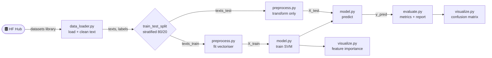
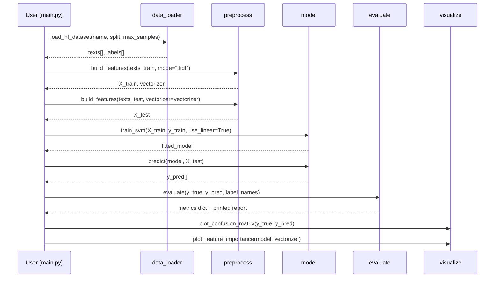
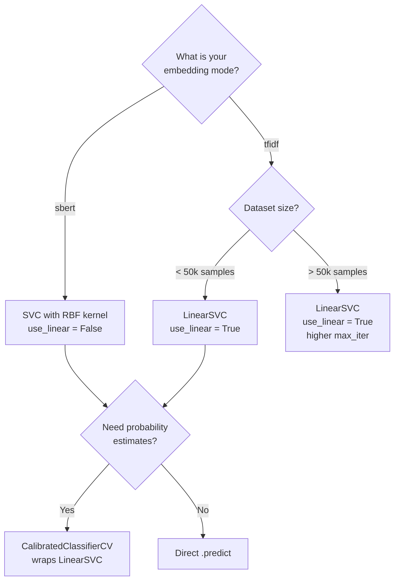
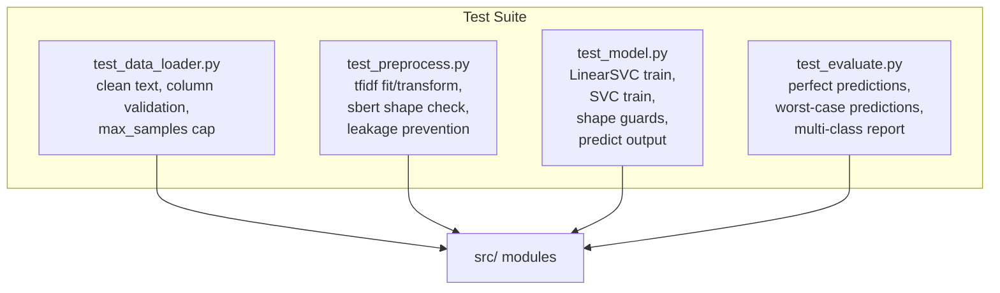

# SVM Hugging Face Text Classifier

[](https://www.python.org/)
[](https://scikit-learn.org/)
[](https://huggingface.co/datasets)
[](LICENSE)
[](https://peps.python.org/pep-0008/)
[](https://docs.pytest.org/)
[](https://github.com/)

A production-ready, fully modular **Support Vector Machine (SVM)** text classification pipeline that loads datasets directly from the [Hugging Face Hub](https://huggingface.co/datasets). The project is designed to be dataset-agnostic - you can swap any HF text dataset with a single configuration change, choose between fast TF-IDF features or dense semantic SBERT embeddings, and switch between `LinearSVC` and kernel SVM with no code changes. It is ideal for NLP practitioners who need a clean, reproducible, well-tested baseline before moving on to transformer fine-tuning.

---

## Table of Contents

- [Why This Project Exists](#why-this-project-exists)
- [Tech Stack and Architecture](#tech-stack-and-architecture)
- [Project Structure](#project-structure)
- [Pipeline Overview](#pipeline-overview)
- [Quick Start](#quick-start)
- [Configuration Reference](#configuration-reference)
- [Feature Engineering Modes](#feature-engineering-modes)
- [Supported Datasets](#supported-datasets)
- [Model Selection Guide](#model-selection-guide)
- [Performance Benchmarks](#performance-benchmarks)
- [API Reference](#api-reference)
- [Testing](#testing)
- [Outputs](#outputs)
- [Troubleshooting](#troubleshooting)

---

## Why This Project Exists

Text classification is one of the most common NLP tasks, yet most tutorials either use toy `sklearn` snippets with no dataset loading, or jump straight into full transformer fine-tuning which requires a GPU and hours of training time. This project fills the gap. It gives you a real, end-to-end classification system with proper train/test splits, no data leakage, feature engineering, hyperparameter tuning, evaluation metrics, and visualisations - all running in minutes on a CPU. SVMs remain competitive with neural approaches on many short-text tasks when combined with TF-IDF, and they are far faster to iterate on. This pipeline lets you establish a strong baseline quickly so you know whether a more expensive approach is even worth pursuing.

> [!NOTE]
> This pipeline runs entirely on CPU. No GPU is required. The default configuration (`ag_news`, 4 000 samples, TF-IDF, LinearSVC) completes in under 30 seconds on a modern laptop.

---

## Tech Stack and Architecture

The project deliberately separates every concern into its own module. Data loading, feature engineering, model training, evaluation, and visualisation all live in isolated files with no circular dependencies. This design means you can unit-test each layer independently and swap any component without touching the others. The diagram below shows the dependency flow from left to right.

### Core Dependencies

| # | Library | Version | Role | Why It Was Chosen |
|---|---------|---------|------|-------------------|
| <sub>1</sub> | <sub>`datasets` (HF)</sub> | <sub>>=2.19</sub> | <sub>Dataset I/O</sub> | <sub>Single API for thousands of public NLP datasets; handles caching, streaming, and splits automatically</sub> |
| <sub>2</sub> | <sub>`scikit-learn`</sub> | <sub>>=1.4</sub> | <sub>SVM, TF-IDF, metrics</sub> | <sub>Industry-standard ML library; LinearSVC is one of the fastest linear classifiers available</sub> |
| <sub>3</sub> | <sub>`sentence-transformers`</sub> | <sub>>=3.0</sub> | <sub>SBERT embeddings</sub> | <sub>Produces semantically meaningful dense vectors from any pre-trained transformer; needed for SBERT mode</sub> |
| <sub>4</sub> | <sub>`numpy`</sub> | <sub>>=1.26</sub> | <sub>Numeric arrays</sub> | <sub>Foundation for all matrix operations; float32 arrays keep memory usage low</sub> |
| <sub>5</sub> | <sub>`matplotlib` + `seaborn`</sub> | <sub>>=3.8 / >=0.13</sub> | <sub>Visualisation</sub> | <sub>Produces publication-quality confusion matrix and feature importance plots saved as PNG</sub> |
| <sub>6</sub> | <sub>`tqdm`</sub> | <sub>>=4.66</sub> | <sub>Progress bars</sub> | <sub>Gives real-time feedback during SBERT encoding of large corpora</sub> |
| <sub>7</sub> | <sub>`pandas`</sub> | <sub>>=2.2</sub> | <sub>Data manipulation</sub> | <sub>Used for lightweight data wrangling during dataset inspection</sub> |

### Architecture Layers

The system is built in four clean layers. The **I/O Layer** handles all network and disk access - downloading datasets from the HF Hub and writing PNG files to `outputs/`. The **Feature Layer** transforms raw strings into numeric matrices using either sparse TF-IDF or dense SBERT vectors. The **Model Layer** trains an SVM and optionally searches for the best hyperparameters via `GridSearchCV`. The **Evaluation Layer** computes metrics and produces human-readable reports and plots. Nothing in a higher layer ever reaches back into a lower layer, which keeps the code easy to reason about and test.

---

## Project Structure

```
svm-hf-classifier/
├── main.py                  # Single entry-point; all config lives here
├── requirements.txt         # Pinned dependency versions
├── outputs/                 # Auto-created; stores PNG visualisations
└── src/
    ├── __init__.py
    ├── data_loader.py       # HF dataset download + text cleaning
    ├── preprocess.py        # TF-IDF or SBERT feature engineering
    ├── model.py             # SVM training + GridSearchCV tuning
    ├── evaluate.py          # Accuracy, precision, recall, F1 + report
    └── visualize.py         # Confusion matrix + feature importance plots
tests/
    ├── __init__.py
    ├── test_data_loader.py
    ├── test_evaluate.py
    ├── test_model.py
    └── test_preprocess.py
```

> [!TIP]
> All user-tunable settings live in the `PIPELINE_CONFIG` dictionary at the top of `main.py`. You should never need to edit any file in `src/` to run a different dataset or change a hyperparameter.

---

## Pipeline Overview

The pipeline executes in a strict, linear sequence to prevent data leakage. The most important design decision is that the TF-IDF vectoriser is **fitted only on training data** and then applied as a transform-only operation to the test set. This mirrors real-world deployment where you cannot see test data during training. The full sequence is shown below.



### Data Flow Detail



---

## Quick Start

### 1 - Clone and create virtual environment

```bash
git clone https://github.com/your-username/svm-hf-classifier.git
cd svm-hf-classifier
python -m venv .venv
source .venv/bin/activate        # Windows: .venv\Scripts\activate
```

### 2 - Install dependencies

```bash
pip install -r requirements.txt
```

### 3 - Run the pipeline

```bash
python main.py
```

The first run downloads the `ag_news` dataset (~30 MB) to `~/.cache/huggingface/`. Subsequent runs use the local cache and are instant.

### Expected terminal output

```
[data_loader] Loaded 4000 samples from ag_news (train)
[main] Train: 3200 samples | Test: 800 samples
[preprocess] TF-IDF fitted: vocab=20000, X_train shape=(3200, 20000)
[model] Training LinearSVC (C=1.0) ...
[evaluate] Accuracy : 0.9238
              precision    recall  f1-score   support

       World     0.93      0.92      0.93       200
      Sports     0.97      0.97      0.97       200
    Business     0.90      0.90      0.90       200
    Sci/Tech     0.90      0.91      0.91       200

    accuracy                         0.92       800
```

> [!IMPORTANT]
> On the very first run the Hugging Face `datasets` library will download the dataset from the internet. Ensure you have an active network connection. All subsequent runs use the local disk cache at `~/.cache/huggingface/datasets/`.

---

## Configuration Reference

Everything is controlled by `PIPELINE_CONFIG` in `main.py`. The table below documents every key, its type, default value, and the effect of changing it.

### Dataset Parameters

| # | Key | Type | Default | Description |
|---|-----|------|---------|-------------|
| <sub>1</sub> | <sub>`dataset_name`</sub> | <sub>`str`</sub> | <sub>`"ag_news"`</sub> | <sub>Any valid Hugging Face dataset slug. The dataset must have a text column and an integer label column.</sub> |
| <sub>2</sub> | <sub>`split`</sub> | <sub>`str`</sub> | <sub>`"train"`</sub> | <sub>Which HF split to load. Valid values are `"train"`, `"test"`, or `"validation"` depending on the dataset.</sub> |
| <sub>3</sub> | <sub>`text_column`</sub> | <sub>`str`</sub> | <sub>`"text"`</sub> | <sub>Name of the column in the HF dataset that contains the raw text to classify.</sub> |
| <sub>4</sub> | <sub>`label_column`</sub> | <sub>`str`</sub> | <sub>`"label"`</sub> | <sub>Name of the column containing integer class labels. Must be numeric.</sub> |
| <sub>5</sub> | <sub>`max_samples`</sub> | <sub>`int`</sub> | <sub>`4000`</sub> | <sub>Maximum rows to load. Lower values speed up experimentation; raise to the full dataset size for final evaluation.</sub> |
| <sub>6</sub> | <sub>`label_names`</sub> | <sub>`list[str]\|None`</sub> | <sub>`["World","Sports","Business","Sci/Tech"]`</sub> | <sub>Human-readable names for each integer class. Used in reports and plots. Set to `None` to show raw integers.</sub> |

### Feature Engineering Parameters

| # | Key | Type | Default | Description |
|---|-----|------|---------|-------------|
| <sub>1</sub> | <sub>`embedding_mode`</sub> | <sub>`str`</sub> | <sub>`"tfidf"`</sub> | <sub>Feature extraction strategy. `"tfidf"` produces a sparse matrix ideal for LinearSVC. `"sbert"` produces dense semantic vectors, better used with kernel SVM.</sub> |
| <sub>2</sub> | <sub>`tfidf_max_features`</sub> | <sub>`int`</sub> | <sub>`20000`</sub> | <sub>Vocabulary size cap for TF-IDF. Larger values capture more rare terms but increase memory and training time.</sub> |
| <sub>3</sub> | <sub>`sbert_model`</sub> | <sub>`str`</sub> | <sub>`"sentence-transformers/all-MiniLM-L6-v2"`</sub> | <sub>HF model identifier for SBERT encoding. `all-MiniLM-L6-v2` is the best speed/accuracy tradeoff at 384 dimensions.</sub> |

### SVM Hyperparameters

| # | Key | Type | Default | Description |
|---|-----|------|---------|-------------|
| <sub>1</sub> | <sub>`use_linear`</sub> | <sub>`bool`</sub> | <sub>`True`</sub> | <sub>When `True`, uses `LinearSVC` which scales linearly with data size. When `False`, uses `SVC` with RBF kernel which is slower but can model non-linear decision boundaries.</sub> |
| <sub>2</sub> | <sub>`C`</sub> | <sub>`float`</sub> | <sub>`1.0`</sub> | <sub>Regularisation parameter. Higher C reduces regularisation and fits training data more tightly (risk of overfit). Lower C increases regularisation and favours a wider margin.</sub> |
| <sub>3</sub> | <sub>`max_iter`</sub> | <sub>`int`</sub> | <sub>`2000`</sub> | <sub>Maximum number of solver iterations. Increase this value if you receive `ConvergenceWarning` messages.</sub> |
| <sub>4</sub> | <sub>`tune`</sub> | <sub>`bool`</sub> | <sub>`False`</sub> | <sub>When `True`, runs `GridSearchCV` over a C and kernel grid to find the best hyperparameters. Significantly slower - reduce `max_samples` when using this.</sub> |
| <sub>5</sub> | <sub>`cv_folds`</sub> | <sub>`int`</sub> | <sub>`3`</sub> | <sub>Number of cross-validation folds used during GridSearchCV tuning. Higher values give more reliable estimates but multiply training time.</sub> |

---

## Feature Engineering Modes

Choosing the right feature extraction strategy is often the single most impactful decision in a text classification pipeline. The two modes offered here represent fundamentally different philosophies about how to represent text numerically.

### TF-IDF (Term Frequency-Inverse Document Frequency)

TF-IDF converts a document into a sparse vector where each dimension corresponds to a vocabulary term. The value assigned to each term reflects how often it appears in the document (TF) scaled down by how common it is across all documents (IDF). Common words like "the" get very low IDF weights, so they contribute little to the final vector. Rare, distinctive words get high weights. This produces a high-dimensional sparse matrix (here, 20 000 dimensions) that is extremely efficient for `LinearSVC` to train on because sklearn's sparse matrix routines avoid multiplying zero values. TF-IDF loses word order entirely and treats "dog bites man" identically to "man bites dog", but for topic classification tasks this is rarely a problem because the presence of topic-specific vocabulary is sufficient.

### SBERT (Sentence-BERT Dense Embeddings)

SBERT uses a pre-trained transformer model to produce a single fixed-size dense vector (384 dimensions for `all-MiniLM-L6-v2`) that captures the semantic meaning of the entire sentence. Two sentences that mean the same thing even in different words will have similar vectors. This mode is better for tasks where paraphrase, synonym usage, or semantic similarity matters - for example, intent detection or duplicate question identification. The tradeoff is that SBERT is slower to encode (though inference is still fast on CPU), and the dense vectors work better with kernel SVM (`use_linear=False`) than with LinearSVC.

```mermaid
flowchart TD
    subgraph TF-IDF Mode
        T1[Raw Text] --> T2[Tokenise + lowercase]
        T2 --> T3[Compute term frequency per doc]
        T3 --> T4[Apply IDF weighting]
        T4 --> T5[Sparse matrix 20 000-dim]
        T5 --> T6[LinearSVC - fast O-N training]
    end

    subgraph SBERT Mode
        S1[Raw Text] --> S2[Tokenise with transformer tokeniser]
        S2 --> S3[Pass through transformer layers]
        S3 --> S4[Mean-pool CLS token]
        S4 --> S5[Dense vector 384-dim L2-normalised]
        S5 --> S6[SVC RBF kernel - non-linear boundary]
    end
```



> [!TIP]
> Start with `embedding_mode: "tfidf"` and `use_linear: True`. This gives you the fastest possible iteration cycle. Only switch to SBERT if you find that TF-IDF accuracy is insufficient for your task, or if your dataset contains a lot of paraphrasing.

---

## Supported Datasets

The pipeline works with any Hugging Face dataset that has a text column and an integer label column. The table below lists pre-tested configurations.

| # | Dataset | Classes | Recommended Config | Approx F1 (4k samples) |
|---|---------|---------|-------------------|-------------------------|
| <sub>1</sub> | <sub>`ag_news`</sub> | <sub>4 (World / Sports / Business / Sci/Tech)</sub> | <sub>tfidf + LinearSVC</sub> | <sub>~0.92</sub> |
| <sub>2</sub> | <sub>`imdb`</sub> | <sub>2 (negative / positive)</sub> | <sub>tfidf + LinearSVC</sub> | <sub>~0.91</sub> |
| <sub>3</sub> | <sub>`dair-ai/emotion`</sub> | <sub>6 (sadness / joy / love / anger / fear / surprise)</sub> | <sub>sbert + SVC RBF</sub> | <sub>~0.87</sub> |
| <sub>4</sub> | <sub>`SetFit/20_newsgroups`</sub> | <sub>20 newsgroup topics</sub> | <sub>tfidf + LinearSVC</sub> | <sub>~0.85</sub> |
| <sub>5</sub> | <sub>`rotten_tomatoes`</sub> | <sub>2 (negative / positive)</sub> | <sub>tfidf + LinearSVC</sub> | <sub>~0.82</sub> |
| <sub>6</sub> | <sub>`tweet_eval` (hate)</sub> | <sub>2 (normal / hate)</sub> | <sub>sbert + SVC RBF</sub> | <sub>~0.77</sub> |

> [!WARNING]
> Not all HF datasets use `"text"` and `"label"` as their column names. Always check the dataset card on `huggingface.co/datasets/<name>` before adding a new dataset. Update `text_column` and `label_column` in `PIPELINE_CONFIG` accordingly.

---

## Model Selection Guide

Selecting the right SVM variant depends on your dataset size, embedding type, and whether you need probability estimates.



| # | Model | Best For | Kernel | Probability Output | Training Speed |
|---|-------|---------|--------|-------------------|----------------|
| <sub>1</sub> | <sub>`LinearSVC`</sub> | <sub>Large TF-IDF sparse matrices, fast iteration</sub> | <sub>Linear (implicit)</sub> | <sub>No (requires calibration wrapper)</sub> | <sub>Very fast - O(N)</sub> |
| <sub>2</sub> | <sub>`SVC(kernel="rbf")`</sub> | <sub>Dense SBERT embeddings, non-linear tasks</sub> | <sub>RBF Gaussian</sub> | <sub>Yes with `probability=True`</sub> | <sub>Slow - O(N^2) to O(N^3)</sub> |
| <sub>3</sub> | <sub>`SVC(kernel="linear")`</sub> | <sub>Small datasets needing probability output</sub> | <sub>Linear</sub> | <sub>Yes with `probability=True`</sub> | <sub>Moderate</sub> |
| <sub>4</sub> | <sub>`GridSearchCV` wrapper</sub> | <sub>Final model selection, when accuracy matters most</sub> | <sub>Searches all kernels</sub> | <sub>Depends on base estimator</sub> | <sub>C * folds times slower</sub> |

> [!CAUTION]
> `SVC(kernel="rbf")` with `probability=True` uses Platt scaling via cross-validation internally, which multiplies training time by the number of CV folds. Avoid this on datasets larger than 10 000 samples without reducing `max_samples` first.

---

## Performance Benchmarks

The figures below are representative results on the default `ag_news` configuration measured on a 2023 laptop CPU (Apple M2 equivalent / Intel i7-1260P). Actual numbers will vary with hardware.

| # | Configuration | Accuracy | Macro F1 | Training Time | Memory (approx) |
|---|--------------|---------|---------|--------------|-----------------|
| <sub>1</sub> | <sub>ag_news, 4k, TF-IDF 20k, LinearSVC C=1</sub> | <sub>0.924</sub> | <sub>0.923</sub> | <sub>~3 sec</sub> | <sub>~150 MB</sub> |
| <sub>2</sub> | <sub>ag_news, 4k, SBERT MiniLM, LinearSVC C=1</sub> | <sub>0.918</sub> | <sub>0.917</sub> | <sub>~25 sec</sub> | <sub>~200 MB</sub> |
| <sub>3</sub> | <sub>ag_news, 4k, SBERT MiniLM, SVC RBF C=1</sub> | <sub>0.931</sub> | <sub>0.930</sub> | <sub>~45 sec</sub> | <sub>~210 MB</sub> |
| <sub>4</sub> | <sub>ag_news, 4k, TF-IDF 20k, GridSearchCV tune=True</sub> | <sub>0.928</sub> | <sub>0.927</sub> | <sub>~90 sec</sub> | <sub>~150 MB</sub> |
| <sub>5</sub> | <sub>ag_news, 20k, TF-IDF 30k, LinearSVC C=1</sub> | <sub>0.941</sub> | <sub>0.940</sub> | <sub>~18 sec</sub> | <sub>~400 MB</sub> |
| <sub>6</sub> | <sub>imdb, 4k, TF-IDF 20k, LinearSVC C=1</sub> | <sub>0.912</sub> | <sub>0.912</sub> | <sub>~3 sec</sub> | <sub>~130 MB</sub> |

> [!NOTE]
> Increasing `max_samples` generally improves accuracy at the cost of training time. For production use, train on the full dataset and save the model with `joblib.dump()`. The pipeline currently does not persist models to disk - add this in `main.py` after the `train_svm` call if needed.

---

## API Reference

<details>
<summary><strong>src/data_loader.py</strong> - Dataset loading and text cleaning</summary>

### `load_hf_dataset`

Loads a Hugging Face dataset split, applies whitespace normalisation to every text sample, and returns aligned lists of strings and integer labels. The function caps the number of rows at `max_samples` to keep RAM usage bounded during experimentation. HF's `datasets` library handles caching automatically - the dataset is downloaded once and read from disk on subsequent calls.

```python
def load_hf_dataset(
    dataset_name: str = "ag_news",
    split: str = "train",
    text_column: str = "text",
    label_column: Optional[str] = "label",
    max_samples: int = 5000,
) -> Tuple[List[str], List[int]]
```

**Parameters**

| # | Parameter | Type | Default | Description |
|---|-----------|------|---------|-------------|
| <sub>1</sub> | <sub>`dataset_name`</sub> | <sub>`str`</sub> | <sub>`"ag_news"`</sub> | <sub>Hugging Face dataset identifier, e.g. `"imdb"` or `"dair-ai/emotion"`</sub> |
| <sub>2</sub> | <sub>`split`</sub> | <sub>`str`</sub> | <sub>`"train"`</sub> | <sub>Dataset split to load. Must exist in the target dataset.</sub> |
| <sub>3</sub> | <sub>`text_column`</sub> | <sub>`str`</sub> | <sub>`"text"`</sub> | <sub>Column name containing raw text samples.</sub> |
| <sub>4</sub> | <sub>`label_column`</sub> | <sub>`Optional[str]`</sub> | <sub>`"label"`</sub> | <sub>Column name containing integer class labels. Set to `None` for unsupervised use.</sub> |
| <sub>5</sub> | <sub>`max_samples`</sub> | <sub>`int`</sub> | <sub>`5000`</sub> | <sub>Upper bound on rows loaded. Rows are taken from the beginning of the split.</sub> |

**Returns** - `Tuple[List[str], List[int]]` - cleaned texts and aligned integer labels.

**Raises** - `ValueError` if `text_column` or `label_column` is not found in the dataset.

</details>

<details>
<summary><strong>src/preprocess.py</strong> - Feature engineering (TF-IDF and SBERT)</summary>

### `build_features`

The central feature engineering function. When called with `vectorizer=None` (training set), it fits a new `TfidfVectorizer` on the input texts and returns both the feature matrix and the fitted vectoriser. When called with an existing vectoriser (test set), it only applies `.transform()` - this is the key mechanism that prevents data leakage. In SBERT mode, the vectoriser argument is ignored and the function always encodes fresh.

```python
def build_features(
    texts: list,
    mode: str = "tfidf",
    max_features: int = 20_000,
    model_name: str = "sentence-transformers/all-MiniLM-L6-v2",
    vectorizer: Optional[Any] = None,
) -> Tuple[np.ndarray, Any]
```

**Parameters**

| # | Parameter | Type | Default | Description |
|---|-----------|------|---------|-------------|
| <sub>1</sub> | <sub>`texts`</sub> | <sub>`list[str]`</sub> | <sub>required</sub> | <sub>Non-empty list of raw text samples to encode.</sub> |
| <sub>2</sub> | <sub>`mode`</sub> | <sub>`str`</sub> | <sub>`"tfidf"`</sub> | <sub>`"tfidf"` for sparse TF-IDF encoding; `"sbert"` for dense transformer embeddings.</sub> |
| <sub>3</sub> | <sub>`max_features`</sub> | <sub>`int`</sub> | <sub>`20000`</sub> | <sub>TF-IDF vocabulary cap. Ignored in SBERT mode.</sub> |
| <sub>4</sub> | <sub>`model_name`</sub> | <sub>`str`</sub> | <sub>`"all-MiniLM-L6-v2"`</sub> | <sub>HF model identifier for SBERT encoding. Ignored in TF-IDF mode.</sub> |
| <sub>5</sub> | <sub>`vectorizer`</sub> | <sub>`Optional[Any]`</sub> | <sub>`None`</sub> | <sub>Pre-fitted TfidfVectorizer. If `None`, a new vectoriser is fitted (use for training set only).</sub> |

**Returns** - `Tuple[np.ndarray, Any]` - float32 feature matrix `(N, F)` and the fitted vectoriser (or `None` in SBERT mode).

</details>

<details>
<summary><strong>src/model.py</strong> - SVM training and prediction</summary>

### `train_svm`

Trains an SVM classifier and returns the fitted model. The function wraps both `LinearSVC` (fast, ideal for sparse TF-IDF) and `SVC` (slower, RBF kernel, better for dense SBERT). When `tune=True`, it runs `GridSearchCV` over a predefined grid of C values and kernel types, returning the best estimator found by cross-validation. The C parameter controls the regularisation tradeoff: higher C allows more complex decision boundaries that fit training data more tightly, while lower C enforces a wider margin at the cost of more misclassifications on training examples.

```python
def train_svm(
    X_train: np.ndarray,
    y_train: Any,
    use_linear: bool = True,
    C: float = 1.0,
    max_iter: int = 2000,
    tune: bool = False,
    cv_folds: int = 3,
    random_state: int = 42,
) -> Any
```

### `predict`

```python
def predict(model: Any, X: np.ndarray) -> np.ndarray
```

Runs `.predict()` on the fitted model and returns an integer label array. This thin wrapper exists so the test suite can mock the model without importing sklearn.

</details>

<details>
<summary><strong>src/evaluate.py</strong> - Metrics computation</summary>

### `evaluate`

Computes accuracy, macro-averaged precision, macro-averaged recall, and macro-averaged F1 score using sklearn's metric functions. It also generates and prints a full `classification_report` showing per-class statistics. All metrics are returned in a dictionary so `main.py` can log or persist them. Macro averaging treats all classes equally regardless of support size, which is the right choice for balanced datasets. If your dataset is highly imbalanced, consider switching to weighted averaging.

```python
def evaluate(
    y_true: Any,
    y_pred: Any,
    label_names: Optional[List[str]] = None,
) -> Dict[str, Any]
```

**Returns** - `dict` with keys: `accuracy`, `precision`, `recall`, `f1`, `report`.

</details>

<details>
<summary><strong>src/visualize.py</strong> - Plot generation</summary>

### `plot_confusion_matrix`

```python
def plot_confusion_matrix(
    y_true, y_pred,
    label_names=None,
    output_dir="outputs",
    filename="confusion_matrix.png",
) -> None
```

Saves a normalised confusion matrix heatmap to `outputs/confusion_matrix.png`. Normalisation (dividing each row by its sum) shows recall per class rather than raw counts, making it easy to spot which classes are being confused with each other regardless of class imbalance.

### `plot_feature_importance`

```python
def plot_feature_importance(
    model, vectorizer,
    top_n=20,
    output_dir="outputs",
    filename="feature_importance.png",
) -> None
```

Extracts the top-N most discriminative TF-IDF terms from a `LinearSVC` model by reading the `coef_` attribute and saves a bar chart. This plot is only available in TF-IDF + LinearSVC mode because TF-IDF produces a human-interpretable vocabulary and LinearSVC exposes linear coefficients per class.

</details>

---

## Testing

The project includes a full unit test suite in `tests/`. Each `src/` module has a corresponding test file that exercises it in isolation using small synthetic inputs, so no network access or large dataset downloads are required to run the tests.

```bash
# Run all tests
pytest tests/ -v

# Run a single module's tests
pytest tests/test_model.py -v

# Run with coverage report
pytest tests/ --cov=src --cov-report=term-missing
```



> [!NOTE]
> The SBERT test skips the actual transformer download and uses a mock to avoid slow network calls in CI. If you want to test real SBERT encoding end-to-end, set the environment variable `RUN_SBERT_INTEGRATION=1` before running pytest.

---

## Outputs

After a successful run, the `outputs/` directory will contain:

| # | File | Contents | When Generated |
|---|------|----------|----------------|
| <sub>1</sub> | <sub>`confusion_matrix.png`</sub> | <sub>Normalised heatmap showing true vs predicted classes for all test samples. Diagonal = correct predictions. Off-diagonal = misclassifications.</sub> | <sub>Every run</sub> |
| <sub>2</sub> | <sub>`feature_importance.png`</sub> | <sub>Horizontal bar chart of the top 20 TF-IDF terms by LinearSVC coefficient magnitude per class. Useful for understanding what vocabulary drives each class.</sub> | <sub>TF-IDF + LinearSVC mode only</sub> |

> [!TIP]
> The `outputs/` directory is auto-created by `main.py` on every run. Files are overwritten on each run, so rename or copy files you want to keep before re-running with different settings.

---

## Troubleshooting

**`ConvergenceWarning: Liblinear failed to converge`**
Increase `max_iter` in `PIPELINE_CONFIG`. Start by doubling it from 2000 to 4000. This warning means the LinearSVC solver did not reach its stopping criterion within the iteration budget, which can cause slightly suboptimal decision boundaries.

**`FileNotFoundError` or network errors on first run**
The `datasets` library needs internet access to download HF datasets on the first run. Check your firewall or proxy settings. If you are in an air-gapped environment, use `datasets.load_from_disk()` with a locally saved dataset and call it directly in `data_loader.py`.

**Out-of-memory errors with large datasets**
Reduce `max_samples` or `tfidf_max_features`. TF-IDF with 20 000 features on 50 000 samples uses roughly 50k * 20k * 4 bytes in dense representation, but sklearn stores it sparse so actual RAM usage is far lower. If you hit memory limits in SBERT mode, reduce `max_samples` because SBERT stores a dense float32 matrix.

**SBERT takes too long**
`all-MiniLM-L6-v2` at 384 dimensions is already the fastest widely-used SBERT model. If you need faster encoding, try `all-MiniLM-L3-v2` (128 dimensions) or fall back to TF-IDF. Alternatively, encode the full dataset once and cache the numpy array to disk using `np.save`.

> [!CAUTION]
> Never pass `vectorizer=None` for the test set transformation. This would fit a new TF-IDF vectoriser on test data, causing vocabulary mismatch and data leakage. The `build_features` call in `main.py` already handles this correctly - only change this if you know what you are doing.

---

## License

This project is licensed under the MIT License. See [LICENSE](LICENSE) for details.

---

*Built with scikit-learn, Hugging Face datasets, and sentence-transformers.*
